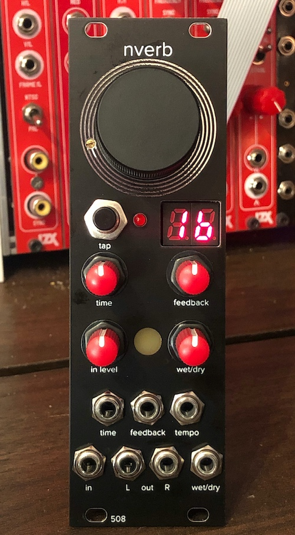

# nverb

Reverb/Delay module based on the Nemesis NemFX reverb-on-a-chip (https://www.profusionplc.com/parts/nemfxsc-rdc1-so)

Main features:
* 16 programs
  * 8 delays
  * 2 choruses
  * 2 spring reverbs
  * 1 plate reverb
  * 3 room/hall reverbs
* Tap Tempo (w/trigger CV input)
* CV control over time / feedback / wet-dry mix
* Mono in / Stereo out

8HP, 35mm deep, 140mA

Note: The NemFX chip is not recommended for new designs, i.e. it's discontinued, but the distributor has them in stock as of this writing -- check before trying to order boards or other parts!

This module, like many of my modules, uses 2mm-pitch male/female headers. Be sure you order/use the right thing!
